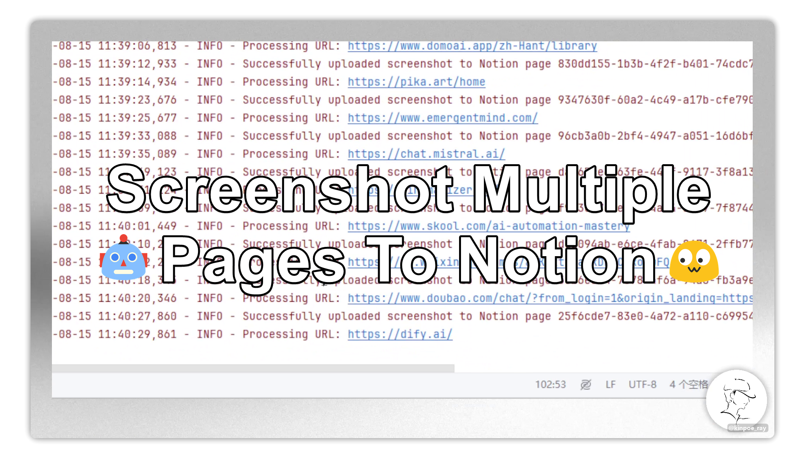
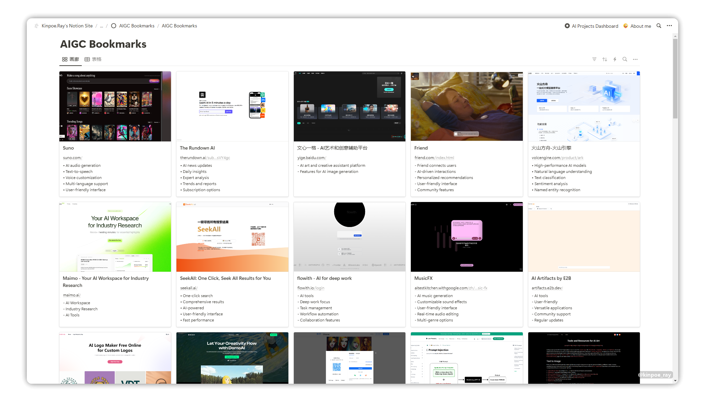
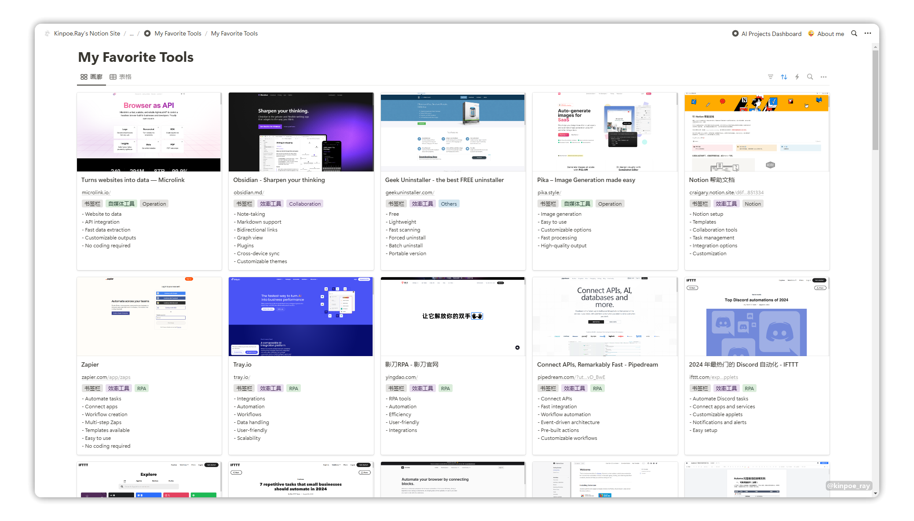

<a id="readme-top"></a>

<p align="center">
    <!--Stars-->
    <a href="https://github.com/kinpoe-ray/Chrome-Screenshot-to-Notion/stargazers" target="_blank">
        </a>
    <!--Forks-->
    <a href="https://github.com/kinpoe-ray/Chrome-Screenshot-to-Notion/network/members" target="_blank">
        </a> 
    <!--Issues-->
    <a href="https://github.com/kinpoe-ray/Chrome-Screenshot-to-Notion/issues" target="_blank">
        </a>
    <!--Discussion-->
    <a href="https://github.com/kinpoe-ray/Chrome-Screenshot-to-Notion/discussions/" target="_blank">
        </a>
    <!--Contributors-->
    <a href="https://github.com/kinpoe-ray/Chrome-Screenshot-to-Notion/graphs/contributors" target="_blank">
        </a>
    <!--License-->
    <a href="https://github.com/kinpoe-ray/Chrome-Screenshot-to-Notion/blob/master/LICENSE.txt" target="_blank">
        </a>
</p>

<p align="center">
  <!--默认自述为英文-->
  <a href="./README.md"></a>
  <!--切换至简中自述-->
  <a href="./README_CN.md"></a>
  <!--Follow my X-->
  <a href="https://twitter.com/intent/follow?screen_name=kinpoe_ray" target="_blank">
      </a>
</p>

<!-- PROJECT LOGO -->
<div align="center">
  <a href="https://github.com/kinpoe-ray/Chrome-Screenshot-to-Notion">
    
  </a>

<h1 align="center">Chrome Screenshot to Notion</h1>

  <p align="center">
    This script automatically takes screenshots of web pages and uploads them to a specific Notion database page. It works with Notion's API and uses Selenium for web crawling and Cloudinary for external image serving.
    <br />
    <a href="https://www.notion.so/kinpoeray/Notion-325f523644d44b8fbb6c7565df2d61cc?pvs=4"><strong>How I achieved it with no programming basics »</strong></a>
    <br />
    <br />
    <a href="https://kinpoeray.notion.site/AIGC-Bookmarks-5202cde5c291464eaf61092f824f67ec">View Demo</a>
    ·
    <a href="https://github.com/kinpoe-ray/Chrome-Screenshot-to-Notion/issues/new?labels=bug&template=bug-report---.md">Report Bug</a>
    ·
    <a href="https://github.com/kinpoe-ray/Chrome-Screenshot-to-Notion/issues/new?labels=enhancement&template=feature-request---.md">Request Feature</a>
  </p>
</div>

<!-- ABOUT THE PROJECT -->
## About The Project

<h3 align="center">AIGC bookmarks</h3>

<!-- PROJECT LOGO -->
<div align="center">
  <a href="https://kinpoeray.notion.site/AIGC-Bookmarks-5202cde5c291464eaf61092f824f67ec">
    
  </a>
</div>

<h3 align="center">Favorite Tools</h3>

<!-- PROJECT LOGO -->
<div align="center">
  <a href="https://www.notion.so/kinpoeray/My-Favorite-Tools-bb7369c3a5a548dd8cb7d94235498839">
    
  </a>
</div>

### Built With

This project utilizes several key Python libraries and frameworks:

`Selenium`: Used for web scraping and taking screenshots of web pages.

`Cloudinary`: Provides cloud-based image hosting services.

`Requests`: Used for making HTTP requests to the Notion API.

`webdriver_manager`: Simplifies the management of ChromeDriver for Selenium.

`json`: Used for parsing and creating JSON data.

`logging`: Provides a flexible framework for generating log messages.

`base64`: Used for encoding and decoding the screenshot data.

`time`: Used for adding delays and handling timeouts.

_All coding driven by AI. ( `Claude` , `ChatGPT` , `Mistral` )_

<!-- FEATURES -->
## Features

- Fetches pages from a specified Notion database
- Takes screenshots of URLs found in the database pages
- Uploads screenshots to Cloudinary
- Updates Notion pages with the screenshot URLs
- Implements retry logic and error handling
- Tracks processed URLs to avoid duplicates

<!-- GETTING STARTED -->
## Getting Started

This is an example of how you may give instructions on setting up your project locally.
To get a local copy up and running follow these simple example steps.

### Prerequisites

- Python 3.7+
- Chrome browser
- Notion API key
- Cloudinary account

### Installation

1. Clone this repository:
   ```
   git clone https://github.com/kinpoe-ray/chrome-screenshot-to-notion
   cd chrome-screenshot-to-notion
   ```

2. Install required packages:
   ```
   pip install -r requirements.txt
   ```

3. Install ChromeDriver (if not already installed):
   ```
   pip install webdriver_manager
   ```

<!-- CONFIGURATION STEPS -->
## Configuration

1. Open the script and update the following variables:
   - `notion_api_key`: Your Notion API key
   - `database_id`: The ID of your Notion database
   - Cloudinary configuration in the `upload_to_image_hosting_service` function
     - `cloud_name`: Your user name 
     - `api_key`: Your API key
     - `api_secret`: Your API secret

2. Adjust the `max_screenshots` variable if needed (default is 50)

<!-- USAGE EXAMPLES -->
## Usage

Run the script with:

```
python chrome-screenshot-to-notion.py
```

The script will:
1. Fetch pages from the specified Notion database
2. Take screenshots of URLs found in the pages
3. Upload screenshots to Cloudinary
4. Update Notion pages with the screenshot URLs

<!-- LOGGING -->
## Logging

The script logs its progress and any errors to the console. You can adjust the logging level in the script if needed.

<!-- ERROR HANDLING -->
## Error Handling

- The script implements retry logic for API calls
- It uses exponential backoff for failed attempts
- Processed URLs are saved to avoid duplicates even if the script is interrupted

<!-- LIMITATIONS -->
## Limitations

- The script is set to run headless. Modify Chrome options if you need to see the browser while running
- It's designed to work with specific Notion page properties ('file' and 'url'). Adjust as needed for your database structure

<!-- CONTRIBUTING -->
## Contributing

Contributions are what make the open source community such an amazing place to learn, inspire, and create. Any contributions you make are **greatly appreciated**.

If you have a suggestion that would make this better, please fork the repo and create a pull request. You can also simply open an issue with the tag "enhancement".
Don't forget to give the project a star! Thanks again!

1. Fork the Project
2. Create your Feature Branch (`git checkout -b feature/AmazingFeature`)
3. Commit your Changes (`git commit -m 'Add some AmazingFeature'`)
4. Push to the Branch (`git push origin feature/AmazingFeature`)
5. Open a Pull Request

### Top contributors

<a href="https://github.com/kinpoe-ray/Chrome-Screenshot-to-Notion/graphs/contributors">
  
</a>

<!-- LICENSE -->
## License

MIT License
