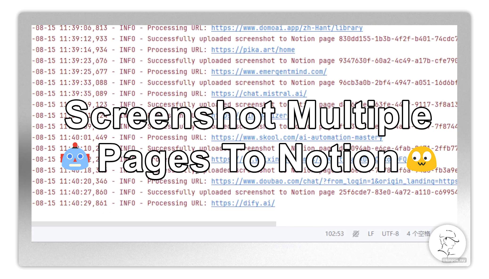
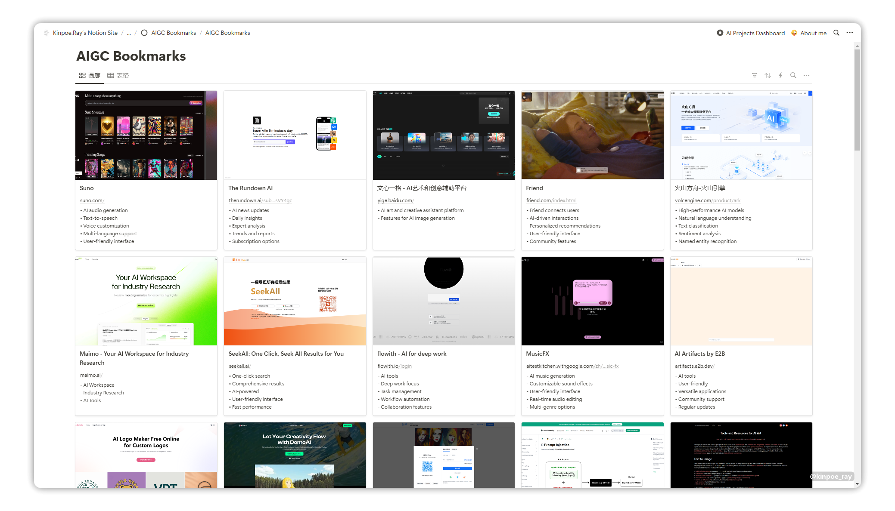
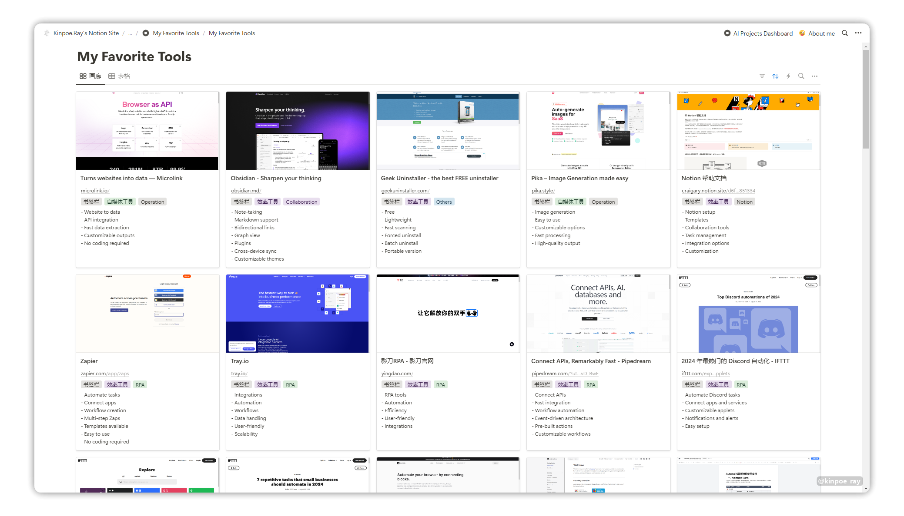

<a id="readme-top"></a>

<p align="center">
    <!--Stars-->
    <a href="https://github.com/kinpoe-ray/Chrome-Screenshot-to-Notion/stargazers" target="_blank">
        </a>
    <!--Forks-->
    <a href="https://github.com/kinpoe-ray/Chrome-Screenshot-to-Notion/network/members" target="_blank">
        </a> 
    <!--Issues-->
    <a href="https://github.com/kinpoe-ray/Chrome-Screenshot-to-Notion/issues" target="_blank">
        </a>
    <!--Discussion-->
    <a href="https://github.com/kinpoe-ray/Chrome-Screenshot-to-Notion/discussions/" target="_blank">
        </a>
    <!--Contributors-->
    <a href="https://github.com/kinpoe-ray/Chrome-Screenshot-to-Notion/graphs/contributors" target="_blank">
        </a>
    <!--License-->
    <a href="https://github.com/kinpoe-ray/Chrome-Screenshot-to-Notion/blob/master/LICENSE.txt" target="_blank">
        </a>
</p>

<p align="center">
  <!--默认自述为英文-->
  <a href="./README.md"></a>
  <!--切换至简中自述-->
  <a href="./README_CN.md"></a>
  <!--Follow my X-->
  <a href="https://twitter.com/intent/follow?screen_name=kinpoe_ray" target="_blank">
      </a>
</p>

<!-- PROJECT LOGO -->
<div align="center">
  <a href="https://github.com/kinpoe-ray/Chrome-Screenshot-to-Notion">
    
  </a>

<h1 align="center">Chrome Screenshot to Notion</h1>

  <p align="center">
    该脚本可自动截取网页截图并上传到特定的 Notion 数据库页面。它与 Notion 的应用程序接口（API）协同工作，并使用 Selenium 进行网络抓取，使用 Cloudinary 提供外部图片服务。
    <br />
    <a href="https://www.notion.so/kinpoeray/Notion-325f523644d44b8fbb6c7565df2d61cc?pvs=4"><strong>我是如何在没有编程基础的情况下实现的 »</strong></a>
    <br />
    <br />
    <a href="https://kinpoeray.notion.site/AIGC-Bookmarks-5202cde5c291464eaf61092f824f67ec">观看演示</a>
    ·
    <a href="https://github.com/kinpoe-ray/Chrome-Screenshot-to-Notion/issues/new?labels=bug&template=bug-report---.md">报告错误</a>
    ·
    <a href="https://github.com/kinpoe-ray/Chrome-Screenshot-to-Notion/issues/new?labels=enhancement&template=feature-request---.md">请求功能</a>
  </p>
</div>


<!-- ABOUT THE PROJECT -->
## 项目简介

<h3 align="center">AIGC bookmarks</h3>

<!-- PROJECT LOGO -->
<div align="center">
  <a href="https://kinpoeray.notion.site/AIGC-Bookmarks-5202cde5c291464eaf61092f824f67ec">
    
  </a>
</div>

<h3 align="center">Favorite Tools</h3>

<!-- PROJECT LOGO -->
<div align="center">
  <a href="https://www.notion.so/kinpoeray/My-Favorite-Tools-bb7369c3a5a548dd8cb7d94235498839">
    
  </a>
</div>

### 技术栈

该项目使用了几个关键的 Python 库和框架：

`Selenium`： 用于网页刮擦和网页截图。

`Cloudinary`：提供基于云的图片托管服务： 提供基于云的图片托管服务。

`Requests`： 用于向 Notion API 提出 HTTP 请求。

`webdriver_manager`： 简化 Selenium ChromeDriver 的管理。

`json`： 用于解析和创建 JSON 数据。

`logging`： 为生成日志信息提供灵活的框架。

`base64`： 用于对截图数据进行编码和解码。

`time`： 用于添加延迟和处理超时。

_所有编码都由人工智能驱动。( `Claude` , `ChatGPT` , `Mistral`) )_

<!-- FEATURES -->
## 功能

- 从指定的 Notion 数据库中获取页面
- 为数据库页面中的 URL 截图
- 将截图上传到 Cloudinary
- 用截图 URL 更新 Notion 页面
- 执行重试逻辑和错误处理
- 跟踪已处理的 URL，避免重复

<!-- GETTING STARTED -->
## 开始

这是一个示例，说明如何在本地设置项目。
要启动并运行本地副本，请按照以下简单示例步骤操作。

### 先决条件

- Python 3.7+
- Chrome 浏览器
- Notion 应用程序接口密钥
- Cloudinary 账号

### 安装


1. 克隆该仓库:
   ```
   git clone https://github.com/kinpoe-ray/chrome-screenshot-to-notion
   cd chrome-screenshot-to-notion
   ```

2. 安装所需程序包:
   ```
   pip install -r requirements.txt
   ```

3. 安装 ChromeDriver （如尚未安装）:
   ```
   pip install webdriver_manager
   ```

<!-- CONFIGURATION STEPS -->
## 配置

1. 打开脚本并更新以下变量:
   - `notion_api_key`: 您的 Notion API 密钥
   - `database_id`: Notion 数据库的 ID
   - Cloudinary 配置中的 `upload_to_image_hosting_service` 函数
     - `cloud_name`: 你的用户名 
     - `api_key`: 你的应用程序接口密钥
     - `api_secret`: 你的应用程序接口密码

2. 调整 `max_screenshots` 变量（默认值为 50）

<!-- USAGE EXAMPLES -->
## 使用方法

运行脚本:

```
python chrome-screenshot-to-notion.py
```

该脚本将
1. 从指定的 Notion 数据库中获取页面
2. 为页面中的 URL 截图
3. 将截图上传到 Cloudinary
4. 用截图 URL 更新 Notion 页面

<!-- LOGGING -->
## 记录

脚本会将进度和任何错误记录到控制台。如果需要，可以在脚本中调整日志记录级别。

<!-- ERROR HANDLING -->
## 错误处理

- 脚本实现了 API 调用的重试逻辑
- 脚本对失败的尝试使用指数式延迟
- 即使脚本中断，也会保存处理过的 URL，以避免重复

<!-- LIMITATIONS -->
## 局限性

- 脚本设置为无头运行。如果需要在运行时看到浏览器，请修改 Chrome 浏览器选项。
- 该脚本旨在使用特定的 Notion 页面属性（“file”和 “url”）。根据你的数据库结构进行必要调整

<!-- CONTRIBUTING -->
## 贡献

有了您的贡献，开放源代码社区才能成为学习、启发和创造的绝佳场所。我们对您的任何贡献**万分感激**。

如果您有更好的建议，请 fork 代码库并创建拉取请求。您也可以简单地以 “enhancement”（改进）为标签打开一个问题。
别忘了给项目打一颗星！再次感谢！

1. 分叉该项目
2. 创建你的特性分支（"git checkout -b feature/AmazingFeature）
3. 提交更改（`git commit -m 'Add some AmazingFeature'`)
4. 推送到分支 (`git push origin feature/AmazingFeature`)
5. 打开拉取请求

### 贡献最多的人

<a href="https://github.com/kinpoe-ray/Chrome-Screenshot-to-Notion/graphs/contributors">
  
</a>

<!-- LICENSE -->
## 许可证

MIT License
